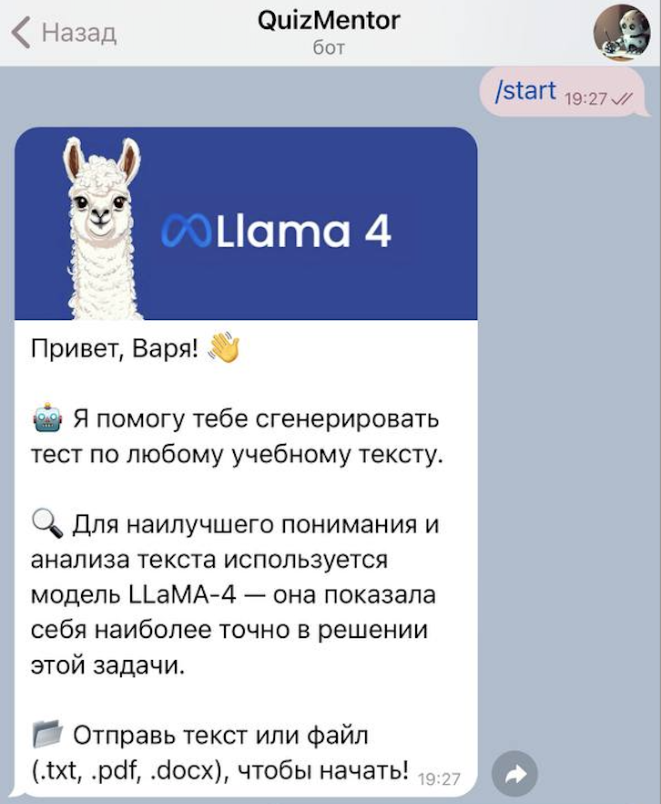
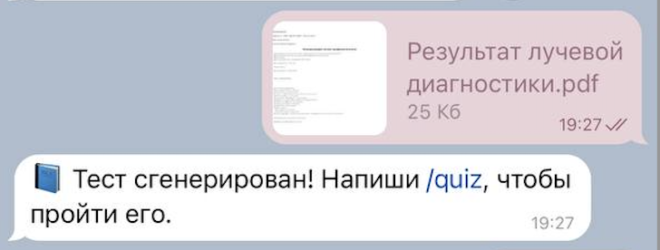
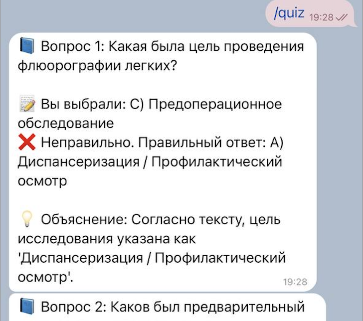
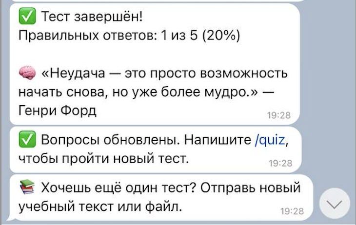

# QuizMentor — Умный Телеграм-Бот для Викторин
*Преврати обучение в игру!*

*Попробовать:* **@quizmentor_bot**

*Проект был разработан в рамках AI-хакатона от Яндекса.*

---

## Описание

**QuizMentor** — это интерактивный Telegram-бот, который помогает создавать и проводить викторины прямо в чате.  
Бот использует возможности больших языковых моделей (LLM) для генерации вопросов, что делает процесс обучения динамичным и интересным.  

Идеален для обучения, тестирования знаний и развлечений!

---

## Возможности
*   **Генерация тестов из текста:** Просто отправьте боту текстовое сообщение.
*   **Работа с файлами:** Загружайте файлы в форматах `.txt`, `.pdf`, `.docx` для создания вопросов.
*   **Интеллектуальный анализ:** Бот использует продвинутую модель LLaMA-4 для глубокого понимания контекста и формулировки точных вопросов.
*   **Интерактивное прохождение:** Проходите тест в удобном формате, получая мгновенную обратную связь.
*   **Подробная статистика:** После завершения теста вы видите процент правильных ответов и мотивирующую цитату.
*   **Обучение на ошибках:** К каждому вопросу прилагается подробное объяснение с указанием верного ответа и цитатой из исходного текста.

## Скриншоты и рабочий процесс

### 1. Запуск бота и приветствие
Начните работу с командой `/start`. Бот представится и объяснит, как с ним работать.



---

### 2. Отправка контента для анализа, генерация теста и начало опроса
Отправьте боту текст или файл (PDF, DOCX, TXT), на основе которого будет создан тест.
После обработки контента бот сообщит, что тест готов. Используйте команду `/quiz`, чтобы начать.



---

### 3. Прохождение теста с обратной связью
Отвечайте на вопросы. Бот сразу показывает, правильный ли был дан ответ, и приводит развернутое объяснение на основе исходного текста.



---

### 4. Результаты и мотивация
В конце теста бот подводит итоги (количество правильных ответов) и вдохновляет вас на дальнейшее обучение.




## 🛠 Технологический стек

*   **Python 3**
*   **python-telegram-bot** — асинхронный фреймворк для работы с Telegram Bot API
*   **LLaMA-4 / Другая LLM** — крупная языковая модель для анализа текста и генерации вопросов
*   **API провайдера LLM** (например, OpenAI, Anthropic, или локальный запуск) — для доступа к модели
*   **Стек для работы с документами** (например, `PyPDF2`, `docx2txt`, `pdfplumber`) — для извлечения текста из загружаемых файлов.

## 🚀 Установка и запуск

1.  **Клонируйте репозиторий:**
    ```bash
    git clone https://github.com/dievavar/LLM_telegram_bot.git
    cd LLM_telegram_bot
    ```

2.  **Установите зависимости:**
    ```bash
    pip install -r requirements.txt
    ```

3.  **Настройте переменные окружения:**
    Создайте файл `.env` и добавьте в него ваш токен от [BotFather](https://t.me/BotFather) и API-ключ для выбранной LLM.
    ```env
    TELEGRAM_BOT_TOKEN=your_super_secret_token_here
    LLM_API_KEY=your_llm_api_key_here
    # LLM_API_BASE=https://your.llm.provider.url # (опционально, если требуется)
    ```

4.  **Запустите бота:**
    ```bash
    python bot.py
    ```

## 📝 Пример использования

1.  Найдите бота в Telegram по имени `@quizmentor_bot`.
2.  Отправьте команду `/start`.
3.  Отправьте боту статью, конспект или любой учебный материал в виде текста или файла.
4.  Дождитесь сообщения о том, что тест сгенерирован.
5.  Введите команду `/quiz` и отвечайте на вопросы, чтобы проверить свое понимание материала!

## 🤝 Contributing

Вклады в проект приветствуются! Если у вас есть предложения по улучшению, идеи новых функций или вы нашли ошибку:
1.  Создайте Issue для обсуждения.
2.  Форкните репозиторий и создайте ветку для вашей фичи (`git checkout -b feature/AmazingFeature`).
3.  Закоммитьте ваши изменения (`git commit -m 'Add some AmazingFeature'`).
4.  Запушьте ветку (`git push origin feature/AmazingFeature`).
5.  Откройте Pull Request.

---
**Автор:** [dievavar](https://github.com/dievavar)  
---
